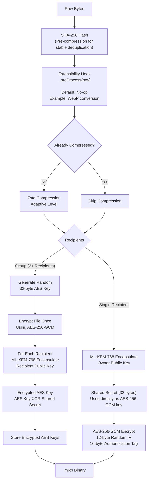

# Majik File

[](https://thezelijah.world) 

[](https://www.iana.org/assignments/media-types/application/vnd.majikah.bundle)

**Platform-agnostic post-quantum file encryption.** Produces self-contained `.mjkb` binary files — sealed with **ML-KEM-768 + AES-256-GCM**, optionally Zstd-compressed, readable without any network access.

> **Note on Architecture:** This library provides the core, decoupled `MajikFile` base class. It knows nothing about chat, threads, or storage backends. For Majikah messaging-specific implementations — including R2 keys, automatic WebP image conversions, and chat context routing — use `MajikMessageFile` (which subclasses `MajikFile`). 

   [](https://opensource.org/licenses/Apache-2.0) 

---

## Contents
- [Majik File](#majik-file)
  - [Contents](#contents)
  - [How it works](#how-it-works)
  - [The .mjkb binary format](#the-mjkb-binary-format)
  - [Extensibility \& Subclassing](#extensibility--subclassing)
  - [Installation](#installation)
  - [Quick start](#quick-start)
    - [1. Encrypt a file (single recipient)](#1-encrypt-a-file-single-recipient)
    - [2. Encrypt for a Group](#2-encrypt-for-a-group)
    - [3. Decrypt a file](#3-decrypt-a-file)
    - [4. Signatures \& Offline Verification](#4-signatures--offline-verification)
  - [API reference](#api-reference)
    - [`MajikFile.create(options)`](#majikfilecreateoptions)
    - [`MajikFile.decryptWithMetadata(source, identity)`](#majikfiledecryptwithmetadatasource-identity)
  - [Type reference](#type-reference)
    - [`MajikFileJSON`](#majikfilejson)
  - [Storage model](#storage-model)
  - [Related Projects](#related-projects)
    - [Majik Message](#majik-message)
    - [Majik Key](#majik-key)
    - [Majik Envelope](#majik-envelope)
  - [Author](#author)

---

## How it works



The encrypted binary is completely self-contained.

---

## The .mjkb binary format

Version: `0x01` (v2 Payload)

```
┌──────────────────────────────────────────────────────┐
│  4 bytes  │  Magic: ASCII "MJKB"  (0x4D 0x4A 0x4B 0x42)  │
│  1 byte   │  Version (currently 0x01)                      │
│ 12 bytes  │  AES-GCM IV (random per file)                  │
│  4 bytes  │  Payload JSON length (big-endian uint32)        │
│  N bytes  │  Payload JSON (UTF-8)                           │
│  M bytes  │  AES-GCM ciphertext (compressed plaintext + 16-byte auth tag) │
└──────────────────────────────────────────────────────┘
```

**Single-recipient payload JSON (v2):**
```json
{
  "mlKemCipherText": "<base64, 1088 bytes>",
  "n": "photo.png",
  "m": "image/png",
  "z": true
}
```

**Group payload JSON (v2):**
```json
{
  "keys": [
    {
      "fingerprint": "<base64 SHA-256 of public key>",
      "mlKemCipherText": "<base64, 1088 bytes>",
      "encryptedAesKey": "<base64, 32 bytes>"
    }
  ],
  "n": "photo.png",
  "m": "image/png",
  "z": true
}
```
*Note: `z` is the explicit compression flag (v2). Older v1 legacy payloads used `c` and inferred decompression from messaging contexts.*

---

## Extensibility & Subclassing

`MajikFile` is engineered to be extended by platforms (like Majik Message) without duplicating cryptographic logic. Subclasses compose the crypto pipeline by overriding protected static hooks:

*   `_preProcess(raw, mimeType)`: Alter bytes before compression (e.g., image resizing).
*   `_resolveCompressionPolicy(mimeType)`: Override default MIME-based compression rules.

When invoking `MySubclass.create()`, the base `_encryptCore()` correctly routes to the subclass's overrides via late-bound static dispatch.

---

## Installation

```bash
npm install @majikah/majik-file
```

---

## Quick start

### 1. Encrypt a file (single recipient)

```typescript
import { MajikFile } from '@majikah/majik-file'

// Identity must be supplied (MajikFile does not manage keys)
const identity = {
  publicKey: 'owner-address',
  fingerprint: 'base64-sha256-of-public-key',
  mlKemPublicKey: new Uint8Array(1184),
  mlKemSecretKey: new Uint8Array(2400), 
}

const fileBytes = await file.arrayBuffer()

const majikFile = await MajikFile.create({
  data: fileBytes,
  userId: 'user-uuid',
  identity,
  originalName: file.name,
  mimeType: file.type,
})

// Export the encrypted binary and metadata
const blob = majikFile.toMJKB()             
const metadata = majikFile.toJSON()         
```

### 2. Encrypt for a Group

```typescript
const majikFile = await MajikFile.create({
  data: fileBytes,
  userId: 'sender-uuid',
  identity: senderIdentity,
  recipients: [
    { fingerprint: 'recipient-a-fp', mlKemPublicKey: recipientAKey, publicKey: 'addr-a' },
    { fingerprint: 'recipient-b-fp', mlKemPublicKey: recipientBKey, publicKey: 'addr-b' },
  ],
})
```

### 3. Decrypt a file

```typescript
const { bytes, originalName, mimeType } = await MajikFile.decryptWithMetadata(
  mjkbBlob,
  { fingerprint: identity.fingerprint, mlKemSecretKey: identity.mlKemSecretKey }
)

const recovered = new Blob([bytes], { type: mimeType ?? 'application/octet-stream' })
```

### 4. Signatures & Offline Verification

`.mjkb` files support appending a cryptographic signature trailer (MJKS) for tamper-evident offline verification.

```typescript
// Sign an existing file
await majikFile.sign(signingKey)

// Export with the appended signature trailer
const signedBlob = majikFile.toSignedMJKB()

// Verify later without a database round-trip
const isValid = await MajikFile.verifySignedMJKB(signedBlob, publicKeys)
```

---

## API reference

### `MajikFile.create(options)`

```typescript
static async create(options: MajikFileCreateOptions): Promise<MajikFile>
```

| Field | Type | Required | Description |
|---|---|---|---|
| `data` | `Uint8Array \| ArrayBuffer` | ✓ | Raw file bytes to encrypt |
| `userId` | `string` | ✓ | Owner's UUID |
| `identity` | `MajikFileIdentity` | ✓ | Owner's full identity |
| `recipients` | `MajikFileRecipient[]` | — | Group recipients. Empty → single-recipient |
| `originalName` | `string` | — | Original filename (embedded in `.mjkb`) |
| `mimeType` | `string` | — | MIME type |
| `id` | `string` | — | UUID record ID. Auto-generated if omitted |
| `bypassSizeLimit` | `boolean` | — | Default `false`. Bypasses 100MB cap |
| `compressionLevel`| `number` | — | Zstd level to apply if compressible |

---

### `MajikFile.decryptWithMetadata(source, identity)`

```typescript
static async decryptWithMetadata(
  source: Blob | Uint8Array | ArrayBuffer,
  identity: MajikFileDecryptIdentity
): Promise<{
  bytes: Uint8Array
  originalName: string | null
  mimeType: string | null
  signature: MajikSignature | null
}>
```

Returns decrypted bytes alongside the file's metadata and signature, directly from the binary payload.

---

## Type reference

### `MajikFileJSON`

The serialised JSON representation of a generic file record. *Notice the lack of platform-specific storage keys (like R2 paths) — those belong to subclasses.*

```typescript
interface MajikFileJSON {
  id: string
  schema_version: number
  kind: "file"
  user_id: string
  original_name: string | null
  mime_type: string | null
  size_original: number
  size_stored: number
  file_hash: string
  encryption_iv: string
  participants: string[]
  kem_alg: string
  cipher_alg: string
  timestamp: string | null
  last_update: string | null
  signature: string | null
}
```

---

## Storage model

`MajikFile` separates the cryptographic artefact from the storage representation:
- **`toMJKB()`** returns the encrypted binary blob (upload this to object storage like R2/S3).
- **`toJSON()`** returns the metadata structure (store this in a database like Supabase).

It is up to the platform implementing `MajikFile` to manage where and how these artifacts are persisted and retrieved.

---

## Related Projects

### [Majik Message](https://apps.microsoft.com/detail/9pmjgvzzjspn)
A secure software product available on Windows and WebApp, powered by these exact post-quantum file encryption techniques.

### [Majik Key](https://majikah.solutions/sdk/majik-key)
Seed phrase account library for generating deterministic ML-KEM-768 keypairs.

### [Majik Envelope](https://majikah.solutions/sdk/majik-envelope)
The core cryptographic engine handling message encryption and multi-recipient key encapsulation.

---
<h2>License</h2>

[Apache-2.0](LICENSE) — free for personal and commercial use.

---
## Author

Made with 💙 by [@thezelijah](https://github.com/jedlsf)

- **Developer**: Josef Elijah Fabian
- **GitHub**: [https://github.com/jedlsf](https://github.com/jedlsf)
- **Official Website**: [https://www.thezelijah.world](https://www.thezelijah.world)